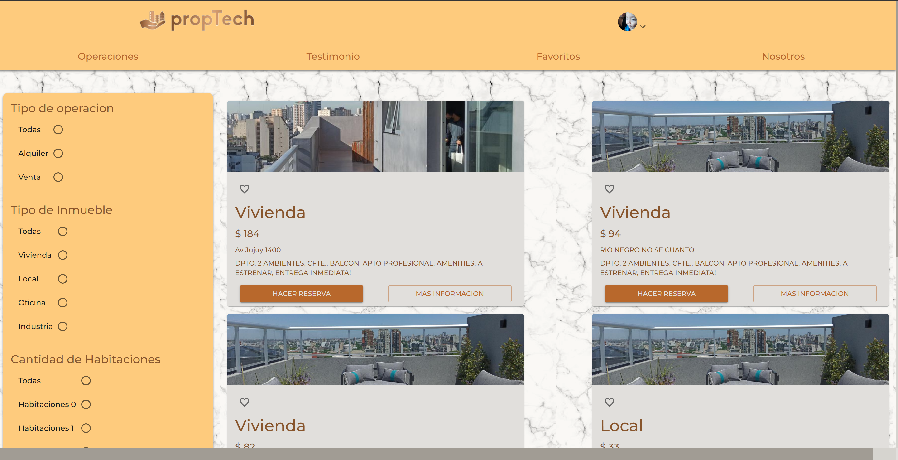
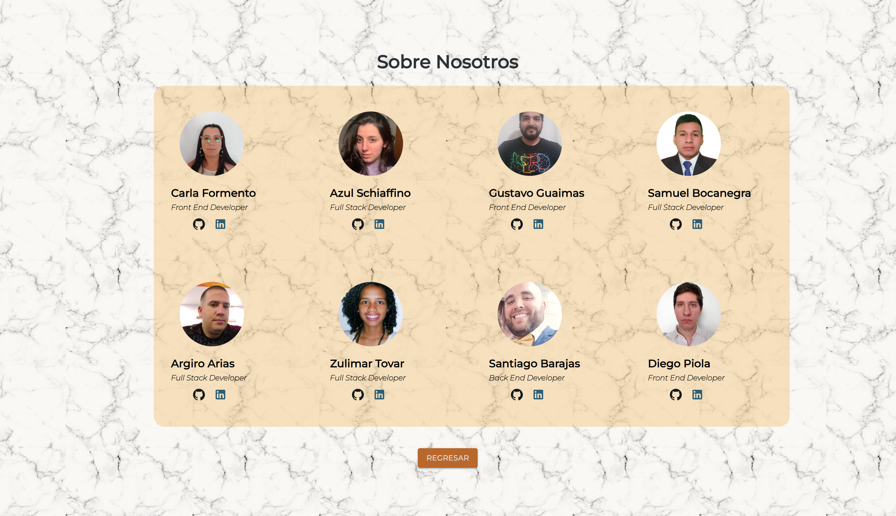

# Proyecto Grupal del Bootcamp HENRY

Este es el proyecto final desarrollado como parte del Bootcamp de Desarrollo Web Full Stack de HENRY. Es una aplicación web que revoluciona la forma en que los usuarios interactúan en el ámbito inmobiliario, permitiendo a los clientes realizar fácilmente reservas y señas para el alquiler o compra de viviendas, además de ofrecer una variedad de servicios adicionales. La aplicación está diseñada para hacer que el proceso de compra, venta o alquiler de propiedades sea más eficiente y transparente.

## Características Principales

- Realiza reservas y señas para alquiler o compra de viviendas.
- Ofrece servicios adicionales como tasaciones de propiedades residenciales o comerciales.
- Integración con Mercado Pago para pagos seguros.
- Espacio dedicado a testimonios de clientes satisfechos.
- Experiencia de usuario excepcional y atención al cliente de calidad.

## Tecnologías Utilizadas

- **Frontend**: React.js, Material-UI, Redux Toolkit, React Query.
- **Backend**: Express.js, Firebase, PostgreSQL, Sequelize.
- **Otras herramientas**: Vite, Axios, Formik, Yup, SweetAlert2.

## Instalación

1. Clona este repositorio en tu máquina local.
2. Ve a la carpeta del proyecto: `cd Grupal`.
3. Instala las dependencias: `npm install`.

## Configuración

1. Crea un archivo `.env` en la raíz del proyecto y agrega las siguientes variables de entorno:

REACT_APP_FIREBASE_API_KEY=your_firebase_api_key
REACT_APP_FIREBASE_AUTH_DOMAIN=your_firebase_auth_domain
REACT_APP_FIREBASE_PROJECT_ID=your_firebase_project_id
REACT_APP_FIREBASE_STORAGE_BUCKET=your_firebase_storage_bucket
REACT_APP_FIREBASE_MESSAGING_SENDER_ID=your_firebase_messaging_sender_id
REACT_APP_FIREBASE_APP_ID=your_firebase_app_id
REACT_APP_FIREBASE_MEASUREMENT_ID=your_firebase_measurement_id

yaml
Copy code

2. Asegúrate de tener PostgreSQL configurado con las credenciales adecuadas.

## Uso

1. Inicia el servidor frontend: `npm run dev`.
2. Inicia el servidor backend: `npm start`.
3. Abre tu navegador y visita: `http://localhost:3000`.

## Contribuciones

¡Contribuciones son bienvenidas! Si encuentras algún problema o tienes una sugerencia, por favor crea un issue en este repositorio.

## Licencia

Este proyecto está bajo la Licencia MIT. Ver el archivo [LICENSE](LICENSE) para más detalles.

---
